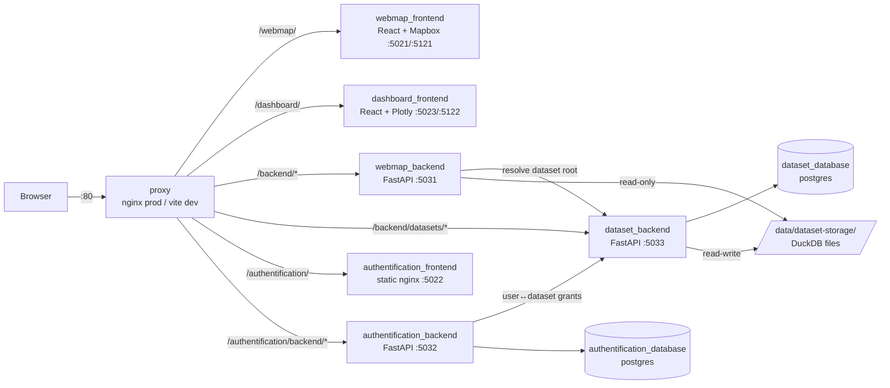

# Architecture

## Services

| Service | Tech | Role |
|---|---|---|
| **proxy** | nginx (prod) / vite (dev) | Single entry point on host port **80**; routes by URL prefix |
| **webmap_frontend** | React, Vite, Mapbox GL | The interactive map (network, volumes, transit, spiders, node flows…) |
| **dashboard_frontend** | React, Vite, Plotly | Statistics dashboard (demographics, mode share, speeds, transit…) |
| **webmap_backend** | FastAPI, DuckDB | All data endpoints for both frontends; reads dataset DuckDBs read-only |
| **dataset_backend** | FastAPI, Postgres | Dataset registry (metadata, ownership, permissions), upload/storage, `resolve` |
| **authentification_backend** | FastAPI, Postgres | Accounts, JWT issuing/refresh, admin API |
| **ops_backend** | FastAPI, Docker SDK | Admin control plane: service status/restart/logs, root-`.env` editor (`/backend/ops/…`, admin-JWT only) |
| **authentification_frontend** | static nginx | Login page + admin panel (user & dataset management) |
| **auth/dataset databases** | Postgres 16 | Persistence for the two services above |

The webmap backend is deliberately **stateless**: no database of its own, all
data comes from the per-dataset DuckDB files plus in-memory caches.

## URL namespace

The proxy is the only externally reachable service. Path prefixes map to
services; `rewrite … break` strips the prefix where the upstream expects
root-relative paths:

| Public path | Upstream | Prefix stripped? |
|---|---|---|
| `/webmap/…` | webmap_frontend | no (vite `base: '/webmap/'`) |
| `/dashboard/…` | dashboard_frontend | no (vite `base: '/dashboard/'`) |
| `/backend/datasets/…` | dataset_backend | **yes** |
| `/backend/…` | webmap_backend | **yes** |
| `/authentification/backend/…` | authentification_backend | **yes** |
| `/authentification/…` | authentification_frontend | **yes** |
| `/` | redirect → `/webmap/` | — |

Order matters: more specific prefixes (`/backend/datasets/`) are matched before
`/backend/`. The FastAPI apps get the stripped prefix back via the `ROOT_PATH`
env var so generated OpenAPI/docs URLs stay correct.

## Port schema

Container ports follow a mnemonic `5 M S T`:

* **M** — mode: `0` prod, `1` dev
* **S** — service: `1` proxy, `2` frontend, `3` backend, `4` database
* **T** — type: `1` webmap, `2` auth, `3` dataset

Examples: webmap backend `5031`, auth frontend `5022`, webmap frontend dev
`5121`, dashboard dev `5122`. Only the proxy binds a host port (80).

## Request flow (one dashboard chart)

`GET /backend/data/7/age.json?canton=Zurich&source=all`

1. **proxy** strips `/backend` → forwards to `webmap_backend:5031/data/7/age.json?…`.
2. **AuthMiddleware** (webmap backend) validates the `access_token` JWT cookie
   (skipped when `LOCAL_RUN=1`).
3. The generic provider endpoint (see [webmap-backend.md](webmap-backend.md))
   asks **dataset_backend** `GET /datasets/7/resolve` (same cookie) → returns the
   filesystem root, e.g. `/data/datasets/public/7`. Cached per (dataset, user).
4. The root is placed in a **ContextVar** (`set_root_override`), so all path
   helpers transparently point at dataset 7 for the rest of the request.
5. `AgeProvider.deliver(params)` runs in a worker thread, queries
   `synthetic.duckdb` / `microcensus.duckdb` read-only, returns a dict.
6. Response: `{ "Zurich": { "Synthetic": {...}, "Microcensus": {...} } }`.
   Errors degrade to `{"error": "..."}` (HTTP 200) so one incompatible dataset
   never breaks the whole page.

## Authentication

* **JWT in cookies** — `access_token` (short-lived) + `refresh_token`.
  Issued by the auth backend on login; all backends validate with the shared
  `JWT_SECRET` (`AuthAPI` package). Frontends retry once through a refresh
  round-trip on 401 (`handle401`).
* **DEV_MODE=1** seeds a dev account (`DEV_EMAIL`/`DEV_PASSWORD`, default
  `dev@local`/`dev`); `LOCAL_RUN=1` on the webmap backend disables auth
  entirely (useful for provider unit testing).
* The **admin panel** (`/authentification/admin/`) manages users and datasets
  (upload, visibility, per-user grants).

## Dataset model

* A **dataset** = one directory containing `synthetic.duckdb` (the MATSim run)
  and optionally `microcensus.duckdb` (survey reference). Format:
  [duckdb-format.md](duckdb-format.md).
* The **registry** lives in the dataset service's Postgres: id, name, slug,
  status (`active`), `is_public`, owner, storage path. Public datasets live at
  `DATASET_STORAGE_ROOT/public/{id}/` — **the directory name is the dataset id**.
* Frontends fetch the list from the dataset service and pass the selected
  `datasetId` in every backend URL (`/backend/data/{id}/…`). Switching datasets
  is purely a URL change; per-dataset caches in the backend are keyed by a
  content signature of the DuckDB files, so replacing a file on disk is picked
  up without cross-dataset leakage.
